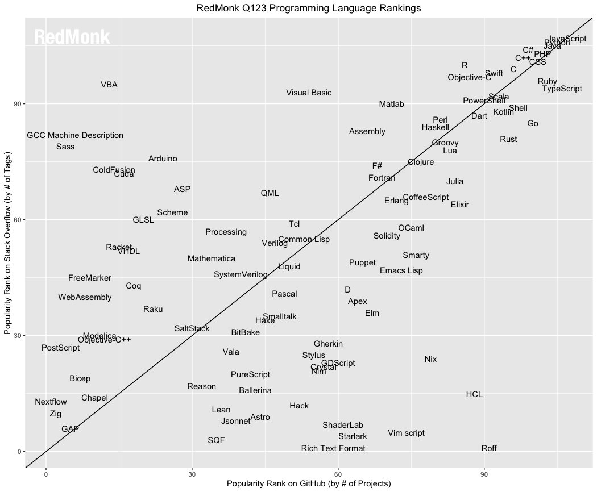

# RHE_cheatsheets <!-- omit in toc -->
- [1. About](#1-about)
- [2. Racket](#2-racket)
- [3. Haskell](#3-haskell)
- [4. Erlang](#4-erlang)
- [5. Meta](#5-meta)

# 1. About
This repo contains 3 cheatsheets that I made for the POLIMI *Principles of programming languages* master course.
The cheatsheets are for the Racket, Haskell and Erlang languages.
These programming languages are not usually used for production code but are a good brick to have for software engineers as they encapsulates usefull properties that led the foundations for others more important languages.
In the files provided you can also find an example of these cheetsheets in pdf format.

# 2. Racket
Scheme is a language of the ancient and glorious Lisp Family.

> [Scheme is intended to] allow researchers to use the language to explore the design, implementation, and semantics of programming languages. (From the R6RS standard)

Scheme, for basics, memory management, introduction to functional programming and object orientation, meta-stuff.

It is unique because it has extremely simple and flexible syntax and semantics.
Good to understand and experiment new concepts/constructs like building an OO language with it.

*Racket* is just a dialect of Scheme, which has a very good implementation and environment.

# 3. Haskell
 - static type systems
 - algebraic data types
 - functional “purity”

In mathematics, functions do not have side-effects.

e.g. if *f*:*N*→*N*,*f(5)* is a fixed value in N,and doesn't depend on time (also called referential transparency).

This is clearly not true in conventional programming languages, Scheme
included as some expressions have side-effects, e.g. vector-set!
Haskell is pure, so it will manage inherently side-effectful
computations (e.g. those with I/O)

# 4. Erlang
 - concurrent-oriented programming language 
 - distribution is almost transparent
 - its core is functional; not pure like Haskell, but more pragmatic, as it suits its industrial setting
 - dynamic typed like Scheme

Erlang is a simple programming language with implemented default concurrency inhertly in it.

# 5. Meta
csarg

<a property="dct:title" rel="cc:attributionURL" href="https://github.com/thisisnotcsarg/RHE_cheatsheets">RHE_cheetsheets</a> by <a rel="cc:attributionURL dct:creator" property="cc:attributionName" href="https://github.com/thisisnotcsarg">csarg</a> is licensed under <a href="http://creativecommons.org/licenses/by-nc-sa/4.0/?ref=chooser-v1" target="_blank" rel="license noopener noreferrer" style="display:inline-block;">CC BY-NC-SA 4.0</a>

https://github.com/thisisnotcsarg